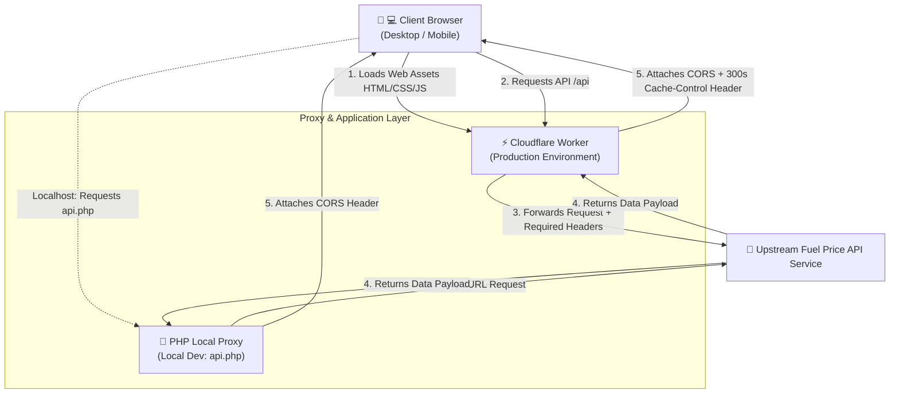
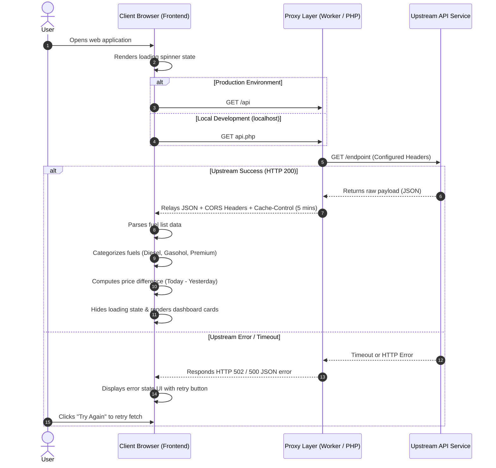

# ⛽ Oil Price Dashboard

[](https://workers.cloudflare.com/)
[](https://developer.mozilla.org/en-US/docs/Web/JavaScript)
[](https://developer.mozilla.org/en-US/docs/Web/HTML)
[](https://developer.mozilla.org/en-US/docs/Web/CSS)
[](https://www.php.net/)
[](LICENSE)

A modern, lightweight, real-time retail fuel price dashboard.

Built with an aesthetic dark glassmorphism UI, zero third-party client dependencies, and dual-mode reverse proxy support for both **Cloudflare Workers** (Production) and local **PHP** development environments.

---

## 🌟 Key Features

- 🔄 **Real-Time Data Feeds**: Fetches latest retail prices with date and time timestamps.
- 📊 **3-Period Comparative Pricing**: Compares yesterday's, today's, and tomorrow's upcoming prices for fuel planning.
- 🏷️ **Price Trend Indicators**: Auto-calculates price differences with intuitive color-coded badges for price hikes (+red), drops (-green), or unchanged rates.
- 🗂️ **Automated Smart Categorization**: Intelligently classifies fuels into Diesel, Gasohol, and Premium tiers.
- 🛡️ **Edge CORS Proxy & Caching**: Reverse proxy layer handles CORS headers and caches responses (`max-age=300`) to protect the upstream API from traffic surges.
- 📱 **Responsive Glassmorphism UI**: Ultra-clean dark layout with ambient animated background orbs, optimized across mobile, tablet, and desktop screens.

---

## 🏗️ Architecture & Workflows

### 1. System Architecture

The client application accesses the upstream data provider through a secure reverse proxy layer to bypass Cross-Origin Resource Sharing (CORS) restrictions without exposing direct upstream connections:



---

### 2. Request Sequence Flow

Step-by-step lifecycle from initial page load to rendering:



---

### 3. Frontend Data Processing Pipeline

```mermaid
flowchart TD
    Start([DOMContentLoaded]) --> Init[Invoke fetchOilPrices]
    Init --> CheckEnv{Detect Hostname}
    
    CheckEnv -->|localhost / 127.0.0.1| UsePHP["Set API_URL = 'api.php'"]
    CheckEnv -->|Production Host| UseCF["Set API_URL = '/api'"]
    
    UsePHP --> CallAPI[Dispatch fetch request]
    UseCF --> CallAPI
    
    CallAPI --> CheckRes{Response OK?}
    
    CheckRes -->|Failure / Network Error| HandleErr["renderError()<br/>Display error prompt + Retry button"]
    CheckRes -->|Success (200)| ParseData["Extract payload & parse fuel list JSON"]
    
    ParseData --> InfoBar["renderInfoBar()<br/>Display announcement date & time"]
    ParseData --> Grouping["classifyOil()<br/>Inspect fuel category"]
    
    Grouping --> Diesel["Diesel Category"]
    Grouping --> Gasohol["Gasohol Category"]
    Grouping --> Premium["Premium Category"]
    
    Diesel --> BuildCards["Calculate delta & status badges<br/>Render Card HTML"]
    Gasohol --> BuildCards
    Premium --> BuildCards
    
    BuildCards --> CheckRemark{Remarks present?}
    CheckRemark -->|Yes| AddRemark["Append remark notices"]
    CheckRemark -->|No| ShowContent["Update main content container"]
    AddRemark --> ShowContent
    
    ShowContent --> Done([Dashboard Ready])
```

---

## 📁 Project Structure

```text
├── index.html        # Main frontend UI (Layout, SVG icons, and client logic)
├── index.css         # Modern glassmorphism stylesheet, animations, design tokens
├── worker.js         # Cloudflare Worker script (Reverse Proxy & Static Asset server)
├── wrangler.toml     # Cloudflare Workers configuration file
├── api.php           # Lightweight PHP cURL proxy for local development
├── .gitignore        # Git ignore rules
└── README.md         # Project documentation and architecture guide
```

---

## 🛠️ Tech Stack

| Component | Technology | Description |
| :--- | :--- | :--- |
| **Frontend Core** | HTML5 / CSS3 / Vanilla JavaScript | Lightweight with zero external client dependencies |
| **Styling** | Vanilla CSS (CSS Grid & Flexbox) | Modern glassmorphism, responsive design tokens |
| **Typography** | Web Fonts | `Inter` and `Noto Sans Thai` font families |
| **Edge Proxy** | Cloudflare Workers | Edge runtime routing `/api` with CORS headers and 5-min caching |
| **Local Proxy** | PHP (cURL) | Local proxy fallback when developing with local web servers |
| **Upstream Data** | External Fuel API | Configurable API endpoint |

---

## 🔒 Security & Environment Configuration

> [!IMPORTANT]
> **Best Practice**: Never commit hardcoded upstream endpoint URLs, API keys, or private domain endpoints into version control.

Configure your upstream endpoint via environment variables or secret bindings:

### Cloudflare Workers (`wrangler.toml` / Secrets)
```toml
# wrangler.toml
name = "oil-price-dashboard"
main = "worker.js"
compatibility_date = "2024-01-01"

[assets]
directory = "."

[vars]
# Define generic public variables here if needed
```

To set sensitive endpoints as secret bindings in Cloudflare:
```bash
npx wrangler secret put UPSTREAM_API_URL
```

### Local Development (`.env` / PHP)
In your local environment, reference upstream URLs using environment variables rather than hardcoded strings. Ensure any `.env` files are included in `.gitignore`.

---

## 🚀 Getting Started (Local Development)

You can run the project locally using either PHP or Cloudflare Wrangler:

### Option 1: Using PHP Built-in Server (Simplest)

1. Open your terminal in the project directory.
2. Start the built-in PHP development server:
   ```bash
   php -S localhost:8000
   ```
3. Open your browser and navigate to:
   ```text
   http://localhost:8000
   ```
   *(The frontend automatically switches to `api.php` when running on `localhost` or `127.0.0.1`)*

---

### Option 2: Using Cloudflare Wrangler

1. Install Node.js and the Wrangler CLI:
   ```bash
   npm install -g wrangler
   ```
2. Authenticate with your Cloudflare account:
   ```bash
   wrangler login
   ```
3. Start the local Worker dev server:
   ```bash
   wrangler dev
   ```
4. Access the local URL provided by Wrangler in your terminal.

---

## 🌐 Deployment Guide

### Deploying to Cloudflare Workers

1. Verify your configuration in [wrangler.toml](file:///d:/DevAppGit/bangchak-oilii/wrangler.toml):
   ```toml
   name = "oil-price-dashboard"
   main = "worker.js"
   compatibility_date = "2024-01-01"

   [assets]
   directory = "."
   ```

2. Deploy the Worker to Cloudflare Edge:
   ```bash
   wrangler deploy
   ```

3. Upon completion, Wrangler will output your assigned URL:
   ```text
   https://<your-project-name>.<your-subdomain>.workers.dev
   ```

---

## 📡 API Reference & Mock Data Schema

### Endpoints
- **Route**: `GET /api` (Cloudflare Worker) or `GET /api.php` (PHP)
- **CORS Header**: `Access-Control-Allow-Origin: *`
- **Caching**: `Cache-Control: public, max-age=300` (5 minutes)

### Generic Response Schema (Template)

```json
[
  {
    "OilPriceDate": "DD Mon YYYY",
    "OilPriceTime": "HH:MM",
    "OilRemark": "Retail price notice remarks...",
    "OilRemark2": null,
    "OilList": "[{\"OilName\":\"Sample Fuel A\",\"PriceToday\":00.00,\"PriceYesterday\":00.00,\"PriceTomorrow\":00.00,\"IconWeb2\":\"...\"},{\"OilName\":\"Sample Fuel B\",\"PriceToday\":00.00,\"PriceYesterday\":00.00,\"PriceTomorrow\":00.00,\"IconWeb2\":\"...\"}]"
  }
]
```

> **Note**: The `OilList` field is received as a serialized JSON string. The client application deserializes this into an array of objects using `JSON.parse()`.

---

## 🎨 Design System & Customization

Core theme tokens and styling variables can be adjusted in [index.css](file:///d:/DevAppGit/bangchak-oilii/index.css):

```css
:root {
    --bg-primary: #0a0e17;       /* Main dark background */
    --accent-diesel: #38bdf8;    /* Diesel theme accent */
    --accent-gasohol: #34d399;   /* Gasohol theme accent */
    --accent-premium: #a78bfa;   /* Premium fuels theme accent */
    --price-up: #f87171;         /* Color indicator for price increase */
    --price-down: #4ade80;       /* Color indicator for price decrease */
}
```

---

## 📄 License & Disclaimer

- Distributed under the [MIT License](LICENSE).
- This project is a template dashboard provided for educational and interface demonstration purposes.
